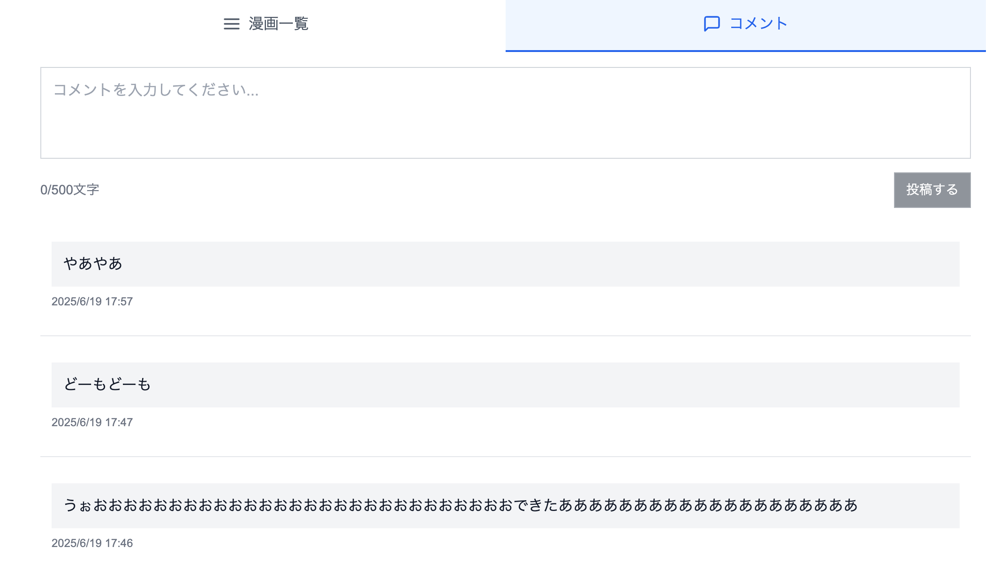
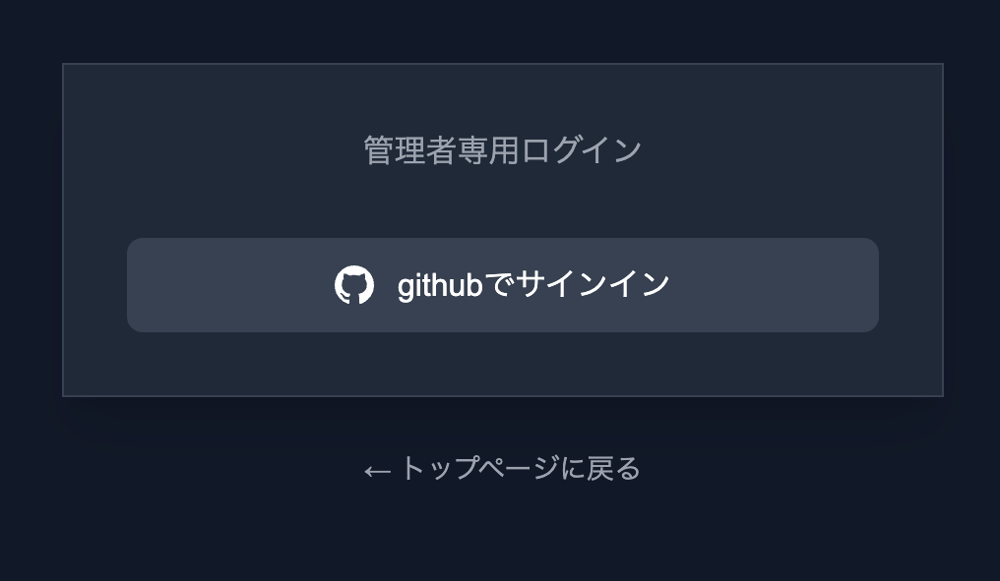
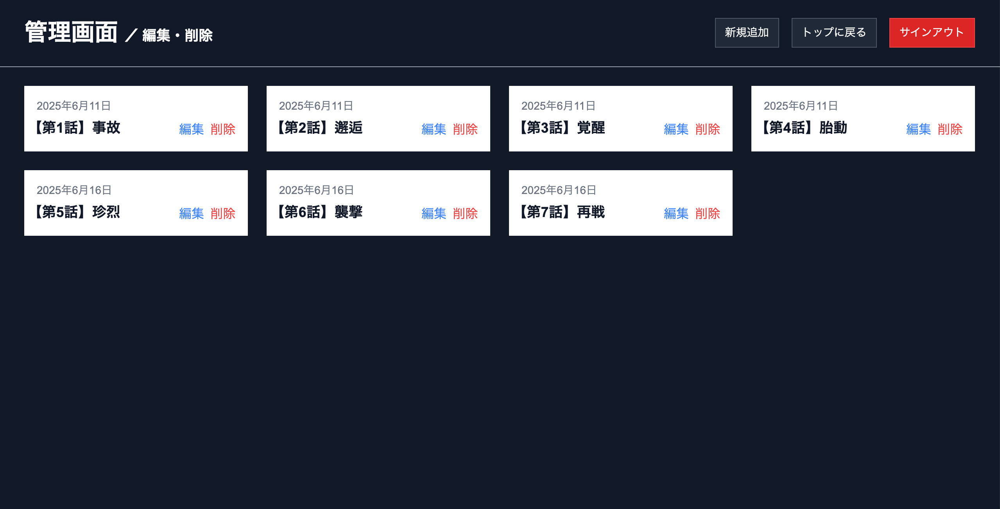
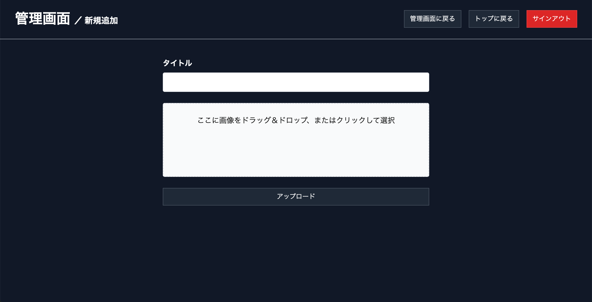

# 漫画ビューアアプリケーション

モダンな技術スタックで構築した、高性能な漫画閲覧・管理アプリケーションです。**Cloudflareの設定とGitHub認証のセットアップだけで、誰でも簡単に独自の漫画サイトを運営できます！**

🚀 **デモサイト**: [https://real-fight.org](https://real-fight.org) -
リレー形式で制作された友人の漫画を例に、実際の機能をご覧いただけます。

## 🎯 プロジェクトの特徴

### ✨ なぜこのアプリケーションを作ったのか

- 個人・サークル・同人作家が手軽に漫画サイトを立ち上げられる環境を提供
- Cloudflareエコシステムを活用した高速・低コストな運用を実現
- レスポンシブ対応で、スマホからデスクトップまで最適な読書体験を提供

### 🔧 開発の背景

Cloudflare全般の理解が必要だったため、[JISOUチャンネルのYouTube動画](https://www.youtube.com/watch?v=z4NeMhE-wdo)を参考にしました。ドキュメント版は[こちら](https://qiita.com/Sicut_study/items/1e03af8bb7f54198bb8a#%E3%81%8A%E3%82%8F%E3%82%8A%E3%81%AB)です。

---

## 🌟 主な機能

### 📖 漫画閲覧機能


**モダンなリーダー体験**

- **レスポンシブUI**: デスクトップ・タブレット・スマートフォン完全対応
- **タッチジェスチャー**: スワイプで直感的なページ送り・戻し
- **キーボードナビゲーション**: 矢印キー（←/→）での快適操作
- **フルスクリーンモード**: 没入感のある読書体験
- **画像プリロード**: 次ページの先読みによるスムーズな遷移
- **SSR対応**: 初回表示の高速化とSEO最適化

### 💬 コメント機能



**リアルタイムなコミュニケーション**

- **コメント投稿**: 各漫画に対するリアルタイムコメント機能
- **一覧表示**: 投稿されたコメントの時系列表示
- **ナビゲーションタブ**: 漫画一覧⇄コメント間のスムーズな切り替え
- **即座更新**: 投稿後のリアルタイム画面更新
- **文字数制限**: 500文字までの適切な制限設定

### 🔐 認証・管理システム



**セキュアな認証機能**

- **GitHub OAuth**: NextAuth v5による安全な認証システム
- **管理者制限**: 環境変数ベースの柔軟なアクセス制御



**コンテンツ管理**

- **漫画アップロード**: 管理者による新規コンテンツ追加
- **順序管理**: ドラッグ&ドロップでの表示順序調整



**直感的なファイル操作**

- **ドラッグ&ドロップ**: React Dropzoneによる現代的なUI
- **プログレス表示**: アップロード状況のリアルタイム表示

### ⚡ パフォーマンス最適化

**エッジファーストアーキテクチャ**

- **エッジデプロイメント**: Cloudflare Workersによるグローバル高速配信
- **画像最適化**: R2ストレージ + CDNによる効率的な画像配信
- **SSR/ISR**: Next.js App Routerによるサーバーサイドレンダリング
- **データベース最適化**: D1による低レイテンシなエッジデータベース
- **インテリジェントキャッシュ**: Cloudflareの自動キャッシュ戦略

---

## 🛠 技術スタック

### 🎨 フロントエンド

- **Next.js 14.2.0** - App Router + SSR/ISRによるモダンなReactフレームワーク
- **React 18** - 最新のConcurrent Features対応
- **TypeScript** - 型安全な開発環境
- **Tailwind CSS** - ユーティリティファーストのスタイリング
- **React Dropzone** - ファイルアップロード機能

### 🔧 バックエンド・API

- **Hono 4.7.11** - 高速・軽量なWebフレームワーク（Cloudflare Workers最適化）
- **Drizzle ORM 0.44.2** - 型安全なSQLiteクエリビルダー
- **NextAuth v5.0.0-beta.28** - 次世代認証・認可システム

### ☁️ インフラストラクチャ（Cloudflareエコシステム）

- **Cloudflare Pages** - JAMstackホスティング
- **Cloudflare Workers** - エッジサーバーレス関数
- **Cloudflare D1** - SQLiteベースのエッジデータベース
- **Cloudflare R2** - オブジェクトストレージ（S3互換）

### 🏗️ レンダリング戦略

- **SSR（Server-Side Rendering）**: 初回表示の高速化とSEO対策
- **ISR（Incremental Static Regeneration）**: 静的生成とキャッシュの最適バランス
- **Client-Side Navigation**: SPA的な滑らかな画面遷移

---

## 📁 プロジェクト構成

```
comic-cloudflare/
├── app/                    # Next.js App Router（SSR対応）
│   ├── [id]/              # 動的ルーティング（漫画詳細）
│   ├── admin/             # 管理者専用ページ
│   │   ├── add/           # コンテンツ追加
│   │   └── page.tsx       # 管理ダッシュボード
│   ├── api/               # API Routes（サーバーサイド）
│   │   ├── [[...route]]/  # Hono統合API
│   │   └── auth/          # NextAuth エンドポイント
│   ├── auth/              # 認証関連ページ
│   │   └── signin/        # サインインページ
│   ├── globals.css        # グローバルスタイル
│   ├── layout.tsx         # ルートレイアウト（SSR）
│   └── page.tsx           # ホームページ（SSR）
├── components/            # Reactコンポーネント
│   ├── comic/            # 漫画閲覧・コメント機能
│   │   ├── Card.tsx       # 漫画カード表示
│   │   ├── CommentForm.tsx    # コメント投稿フォーム
│   │   ├── CommentSection.tsx # コメント管理
│   │   ├── List.tsx       # 漫画一覧
│   │   ├── MainDisplay.tsx    # メイン表示エリア
│   │   ├── NavigationTabs.tsx # タブナビゲーション
│   │   └── Viewer.tsx     # 漫画ビューア本体
│   └── controls/         # UI制御コンポーネント
├── context/              # React Context（状態管理）
├── hooks/                # カスタムHooks
├── lib/                  # ユーティリティ・API層
├── types/                # TypeScript型定義
├── db/                   # データベーススキーマ
├── auth.ts               # NextAuth設定
├── auth.config.ts        # 認証設定
├── drizzle.config.ts     # ORM設定
├── middleware.ts         # Next.js Middleware
└── wrangler.jsonc        # Cloudflare設定
```

---

## 🚀 セットアップ手順

### 📋 前提条件

- **Node.js 18+**
- **npm/yarn/pnpm** パッケージマネージャー
- **Cloudflareアカウント**
- **GitHubアカウント** （OAuth認証用）

### 1️⃣ リポジトリのクローン

```bash
git clone https://github.com/Kyoya67/comic-cloudflare.git
cd comic-cloudflare
```

### 2️⃣ 依存関係のインストール

```bash
npm install
# または
pnpm install  # 推奨: 高速インストール
# または  
yarn install
```

### 3️⃣ 環境変数の設定

`.env.local`ファイルを作成：

```env
# NextAuth設定
AUTH_SECRET=your-auth-secret-here
AUTH_GITHUB_ID=your-github-oauth-app-id  
AUTH_GITHUB_SECRET=your-github-oauth-app-secret
ADMIN_GITHUB_USERNAME=your-github-username

# Cloudflare設定
CLOUDFLARE_ACCOUNT_ID=your-cloudflare-account-id
CLOUDFLARE_DATABASE_ID=your-d1-database-id
CLOUDFLARE_D1_TOKEN=your-d1-api-token

# サイトURL
NEXT_PUBLIC_SITE_URL=your-site-url
```

### 4️⃣ データベースのセットアップ

```bash
# マイグレーション生成
npm run db:generate

# データベースに適用
npm run db:push
```

### 5️⃣ 開発サーバーの起動

```bash
npm run dev
```

🌐 ブラウザで [http://localhost:3000](http://localhost:3000) を開いて確認

## データベーススキーマ

### comicsテーブル

```sql
CREATE TABLE comics (
    id TEXT PRIMARY KEY,           -- UUID
    title TEXT NOT NULL,           -- コミックタイトル
    imageUrl TEXT NOT NULL,        -- 画像ファイルパス
    order INTEGER NOT NULL,        -- 表示順序
    updatedAt TEXT NOT NULL        -- 更新日時（ISO形式）
);
```

### commentsテーブル

```sql
CREATE TABLE comments (
    id TEXT PRIMARY KEY,           -- UUID
    comic_id TEXT NOT NULL,        -- コミックID（外部キー）
    content TEXT NOT NULL,         -- コメント内容
    created_at TEXT NOT NULL,      -- 作成日時（ISO形式）
    FOREIGN KEY (comic_id) REFERENCES comics(id)
);
```

## API エンドポイント

### コミック関連

- `GET /api/comics` - 全コミックの取得
- `POST /api/upload` - 新しいコミックのアップロード（管理者のみ）
- `GET /api/image/:filename` - R2ストレージからの画像配信

### コメント関連

- `GET /api/comics/:comicId/comments` - 特定コミックのコメント取得
- `POST /api/comics/:comicId/comments` - 新しいコメントの投稿

## 認証システム

### GitHub OAuth設定

1. GitHubで新しいOAuthアプリを作成
2. Authorization callback URLを設定:
   `https://your-domain.com/api/auth/callback/github`
3. Client IDとClient Secretを環境変数に設定
4. `ADMIN_GITHUB_USERNAME`環境変数で管理者を指定

### 管理者制限

管理者機能は以下の方法で制限されています：

- 環境変数`ADMIN_GITHUB_USERNAME`で指定されたGitHubユーザーのみアクセス可能
- `/admin`パスへのアクセスは認証が必要
- コミックアップロード機能は管理者のみ利用可能

## Cloudflareデプロイメント

### 1. Cloudflareリソースの準備

```bash
# D1データベースの作成
wrangler d1 create <任意のD1データベース名>

# R2バケットの作成
wrangler r2 bucket create <任意のR2バケット名>
```

### 2. 環境変数の設定

Cloudflare Dashboardで以下の環境変数を設定：

- `AUTH_SECRET`
- `AUTH_GITHUB_ID`
- `AUTH_GITHUB_SECRET`
- `ADMIN_GITHUB_USERNAME`
- `NEXT_PUBLIC_SITE_URL`

### 3. データベースマイグレーション

```bash
# 本番環境へのマイグレーション適用
wrangler d1 migrations apply <任意のD1データベース名> --remote
```

### 4. デプロイ

```bash
# プロダクションビルドとデプロイ
npm run deploy

# プレビューデプロイ
npm run preview
```

## 利用可能なスクリプト

```bash
npm run dev          # 開発サーバー起動
npm run build        # プロダクションビルド
npm run start        # プロダクションサーバー起動
npm run lint         # ESLintによるコード検査
npm run deploy       # Cloudflareへのデプロイ
npm run preview      # プレビューデプロイ
npm run cf-typegen   # Cloudflare型定義生成
npm run db:generate  # データベースマイグレーション生成
npm run db:push      # データベースマイグレーション適用
```
